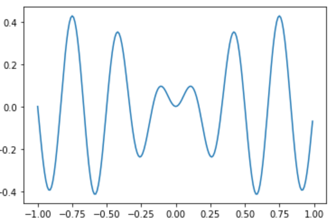
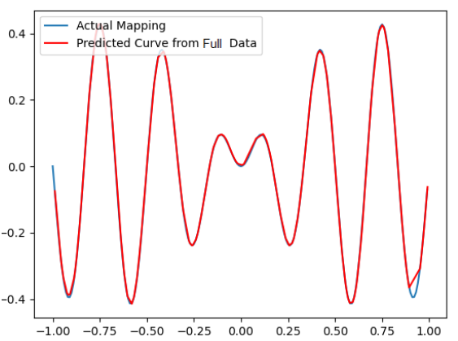

## Project 1: Non-Linear Regression via Feedforward Neural Net w/ Back-propagation
The goal of this project was to create a neural net that could solve a non-linear regression equation. The neural net was created using keras, and scikit-learn was used for K-fold cross validation. During this project, I investigated the effect of varying the number of hidden nodes within the neural, and the number of data points the model was given.
The following image is the original non-linear equation I was trying to solve. 

The most accurate model created, was the one given the most amount of data points, and the most hidden nodes. It's prediction of the smooth curve is shown overlaid in red.

## Project 2: Kohonen Self Organizing Map (KSOM)

The goal of this project was to create a DNN with PyTorch capable of producing a semantic segmentation model which achieves a mean Intersection over Union (mIOU) score of >40%.

Semantic Segmentation is the task of catergorizing each pixel in some input image into a specifc class, and for this project specifially, the classes were people, and cars.
Some example input, and corresponding output images can be seen below.

| Original Image  | Semantic Segmentation Output|
| :-------------: |:---------------------------:|
|  | |
|  | |
|  | |

The colour density of the points represents the probability that the space is occupied (darker = higher probability).

## Project 4: Practical Application of an Extended Kalman Filter (EKF) 
Provided measurements of known landmark location, and an inertial measurement unit sensor readings, this project involved fusing the aforementioned datastreams in order to estimate where the vehicle is in the workspace. 

In order for the filter to work, I created a function which computes and returns the Jacobian of the measurement data for a given landmark and the current vehicle state. 

I then had to properly update the vehicle state and covariance estimate using the landmark's true location, as well as it's LiDAR rand and bearing estimate. 

Finally I implemented the Kalman Filter loop to recursively estimate the state of the vehicle as it progresses through the workspace.

The following image shows the path the vehicle actually traverses in orange, and shows the Extended Kalman Filter's estimate of the vehicle location in blue.

