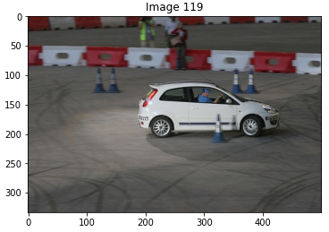
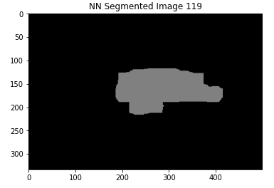
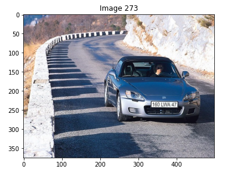
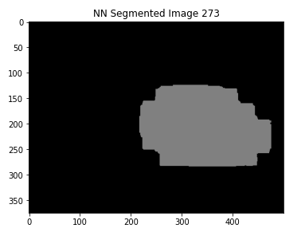
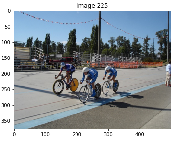
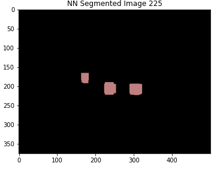
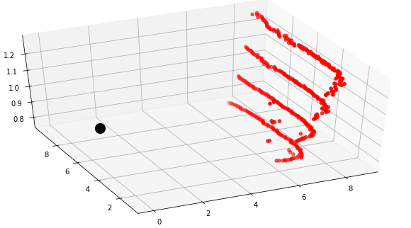
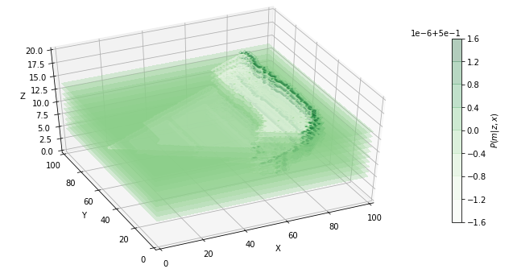
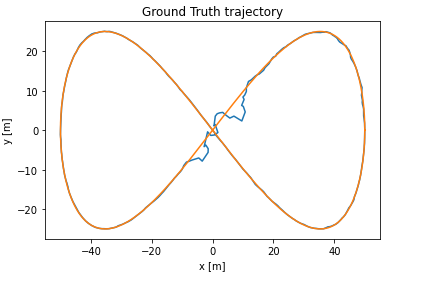

 ## Project 1: Lane Lines Image Detection w/ OpenCV

The goal of this project was to use Python and OpenCV to create an image processing pipeline to detect the lane lines in a video taken from a car travelling along a road. The pipeline I created has the following steps:

1. Convert RGB image to grayscale
2. Apply Gaussian filter to image
3. Use Canny Edge detection to find strong lines within image
4. Apply a Region of Interest Mask in order to just look at the lane lines
5. Hough Transform the image to create two continuous lines, one for each lane line
6. Draw the detected lane lines over top of the original image

The following GIF shows the output of the lane line detection pipeline:
      

## Project 2: Semantic Segmentation via Deep Neural Net (DNN)

The goal of this project was to create a DNN with PyTorch capable of producing a semantic segmentation model which achieves a mean Intersection over Union (mIOU) score of >40%.

Semantic Segmentation is the task of catergorizing each pixel in some input image into a specifc class, and for this project specifially, the classes were people, and cars.
Some example input, and corresponding output images can be seen below.

| Original Image  | Semantic Segmentation Output|
| :-------------: |:---------------------------:|
|  | |
|  | |
|  | |

In the first and second outputs, the car has been correctly classified. In the third output image, the people riding the bikes have been correctly identified.

## Project 3: Probabilistic Occupancy Grid Generation from LiDAR Data

In this project, I was given LiDAR sensor readings, which I converted into a Probabilistic Occupancy Grid. This involved converting the data from spherical coordinates, to a Cartesian coordinate space, creating a logodds occupancy grid, and then converting said grid into the Probabilistic Occupancy Grid. The following image is a visual representation of the LiDAR Scanner (black) with a point cloud of its readings (red).

 

After the conversions, the Probabilistic Occupancy Grid can be visalized as follows:

The colour density of the points represents the probability that the space is occupied (darker = higher probability).

## Project 4: Practical Application of an Extended Kalman Filter (EKF) 
Provided measurements of known landmark location, and an inertial measurement unit sensor readings, this project involved fusing the aforementioned datastreams in order to estimate where the vehicle is in the workspace. 

In order for the filter to work, I created a function which computes and returns the Jacobian of the measurement data for a given landmark and the current vehicle state. 

I then had to properly update the vehicle state and covariance estimate using the landmark's true location, as well as it's LiDAR rand and bearing estimate. 

Finally I implemented the Kalman Filter loop to recursively estimate the state of the vehicle as it progresses through the workspace.

The following image shows the path the vehicle actually traverses in orange, and shows the Extended Kalman Filter's estimate of the vehicle location in blue.

