## Project 1: Non-Linear Regression via Feedforward Neural Net w/ Back-propagation
The goal of this project was to create a neural net that could solve a non-linear regression equation. The neural net was created using keras, and scikit-learn was used for K-fold cross validation. During this project, I investigated the effect of varying the number of hidden nodes within the neural net, and the number of training data points the neural net was given.

  <b>Original Non-Linear Equation Model is Trying to Predict</b> 
  

The most accurate model created, was the one given the most amount of data points, and the most hidden nodes. It's prediction of the smooth curve is shown overlaid in red.

  <b>Model Prediction</b> 
  

## Project 2: Kohonen Self Organizing Map (KSOM)

Given an image comprised of random coloured pixels, I created a Kohonen Self Organizing Map to cluster similar hues into the same neighbourhoods. 

  <b>Initial Random Image</b> 
  

Once I had created the KSOM, I studied the effects of changing the number of epochs run, as well as the initial neighbourhood radius (sigma). I learned that the more epochs ran, the smoother of a colour gradient was output, and that there was a fine line to having a neighbourhood radius not too large or too small. 
Some of the KSOM outputs studied are shown in the table below.

| Sigma = 10  | Sigma = 40|Sigma = 70|
| :-------------: |:---------------------------:|:-:|
|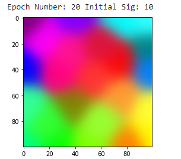 |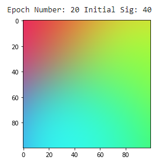 |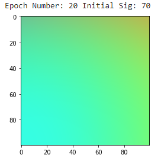 |
| |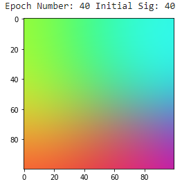 |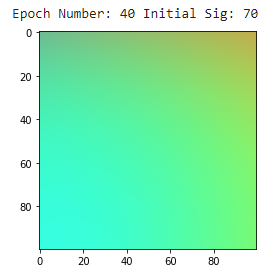 |
|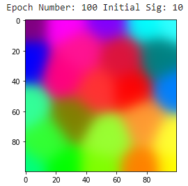|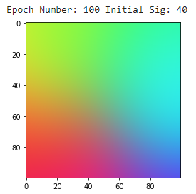|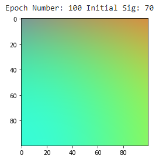|
|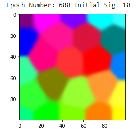|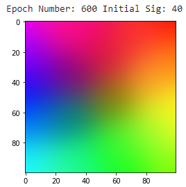|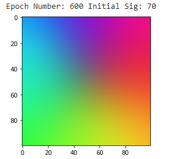|

## Project 3: MLP vs Deep Learning CNN Study
Using TensorFlow, Keras, and scikit-learn, I created a multi-layer perceptron and two deep learning CNN's  with different architectures to compare the training and testing accuracies of the models. I also evaluated the training times for each model. 

  <b>Model Results</b> 
  

These results indicate the CNN's are much more accurate than a multi-layer perceptron. CNN1 having a training accuracy so much higher than it's testing accuracy points towards the model being overfit. However, CNN2 having mor balanced accuracies indicates it is the best model. 

  <b>MLP Accuracies</b> 
  

  <b>Model Results</b> 
  
  <b>Time to Train: 50.66s</b> 

  <b>Model Results</b> 
  
  <b>Time to Train: 14.3s</b> 

